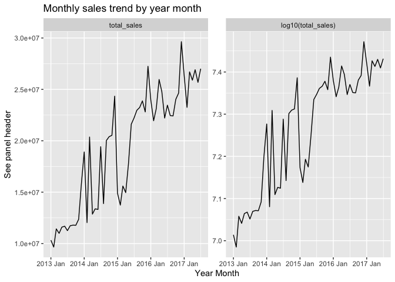
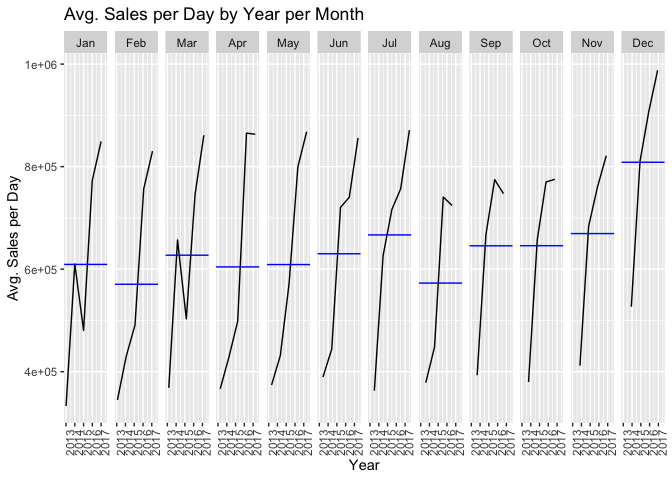
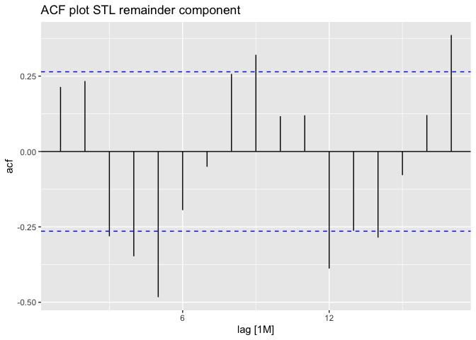
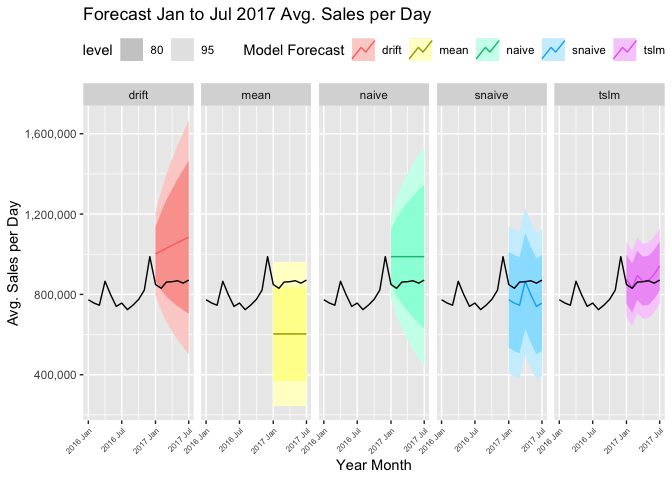

Supermarket Sales Time Series Investigation: Part 1
================

### Notebook Context

  - time series analysis using [supermarket sales data from
    Kaggle](https://www.kaggle.com/c/store-sales-time-series-forecasting/data)
  - work with data at monthly aggregated level to start given common
    business scenario to analyze monthly sales/trends
  - techniques and method inspired by [Forecasting Principles and
    Practice | Hyndman & Athanasopoulos](https://otexts.com/fpp3/)

### Objective

1.  Visualize sales time series trends
2.  Decompose monthly sales into trend-cycle and seasonal components
3.  Identify product families that are trending and/or seasonal
4.  Apply simple methods for forecast monthly average sales per day

<!-- end list -->

``` r
library(fpp3)
library(tidyverse)
library(ggfortify)
library(gridExtra)
```

### Data Prep

``` r
### use Kaggle training dataset to represent our "business data"
train_raw <- read_csv("store-sales-time-series-forecasting/train.csv")
```

#### Monthly Sales

  - aggregate to monthly sales by product family across stores
  - use tsibble object for time series analysis

<!-- end list -->

``` r
monthly_sales_ts <- train_raw %>%
      ### aug is a partial month so we filter to dates prior to Aug 1
      filter(date < '2017-08-01') %>%
      group_by(family, 
               year_month = yearmonth(format_ISO8601(date, precision ="ym"))) %>%
      summarise(total_sales = sum(sales),
                sales_days = n_distinct(date),
                avg_sales_per_day = total_sales/sales_days) %>%
      as_tsibble(index = year_month,
                 key = c("family"))

head(monthly_sales_ts)
```

    ## # A tsibble: 6 x 5 [1M]
    ## # Key:       family [1]
    ## # Groups:    family [1]
    ##   family     year_month total_sales sales_days avg_sales_per_day
    ##   <chr>           <mth>       <dbl>      <int>             <dbl>
    ## 1 AUTOMOTIVE   2013 Jan        6557         31              212.
    ## 2 AUTOMOTIVE   2013 Feb        7220         28              258.
    ## 3 AUTOMOTIVE   2013 Mar        7635         31              246.
    ## 4 AUTOMOTIVE   2013 Apr        7485         30              250.
    ## 5 AUTOMOTIVE   2013 May        9034         31              291.
    ## 6 AUTOMOTIVE   2013 Jun        8311         30              277.

### 1\. Visualize sales time series trends

#### Sales by Year

  - Jan - Jul Sales increase YoY
  - Visualize Jan - Jul sales by year due to most recent year being a
    partial year

<!-- end list -->

``` r
monthly_sales_ts %>%
   filter(month(year_month)<=7) %>%
   ungroup() %>%
   index_by(year = year(year_month)) %>%
   summarise(total_sales = sum(total_sales)) %>%
   autoplot(total_sales) +
  labs(title="Sales trend by year",
    y="Total Sales",
    x="Year")
```

<!-- -->

#### Sales by Month

  - sales data from stores in Ecuador (macro country context could
    likely shed light on some of the large dips)
  - for example, late 2014/early 2015 seems to correlate with oil price
    crash
  - large part of Ecuador’s economy is based on the export of oil
  - callout: calendar day bias here (not all calendar days have equal
    number of sales days)
  - log transformed variable attempts to stabilize variance

<!-- end list -->

``` r
monthly_sales_ts %>%
  ungroup() %>%
  index_by() %>%
  summarise(
    total_sales = sum(total_sales)
  ) %>%
  autoplot(vars(total_sales, log10(total_sales))) +
  labs(title="Monthly sales trend by year month",
       y="See panel header",
       x="Year Month")
```

<!-- -->

#### Aggregated monthly sales data

  - generate monthly sales time series tsibble object
  - “avg\_sales\_per\_day” used to control for number of sales days
    difference by calendar month

<!-- end list -->

``` r
cal_month_sales <- monthly_sales_ts %>%
   ungroup() %>%
   index_by(year_month) %>%
   summarise(avg_sales_per_day = sum(total_sales)/unique(sales_days)) %>%
   as_tsibble(index=year_month, key=NULL)
```

#### Average sales per day trend

  - used to control for number of sales days difference by calendar
    month

<!-- end list -->

``` r
cal_month_sales %>%
   index_by(year(year_month)) %>%
   mutate(avg_avg_sales_per_day_per_year = mean(avg_sales_per_day)) %>%
   autoplot(avg_sales_per_day) +
   geom_line(aes(y=avg_avg_sales_per_day_per_year, group=year(year_month), 
                 color="Avg. of (Avg. Sales per Day) per Year"),
             linetype="dashed",
             alpha=0.5,
             size=1.5) +
   theme(legend.position = "top") +
   labs(title="Avg. Sales per Day by Year Month",
        y="Avg. Sales per Day",
        x="Year Month",
        color="")
```

<!-- -->

#### Compare avg sales per day YoY performance by month

``` r
cal_month_sales %>%
      gg_subseries(avg_sales_per_day) +
      labs(title="Avg. Sales per Day by Year per Month",
        y="Avg. Sales per Day",
        x="Year",
        color="")
```

<!-- -->

#### Avg. Sales per Day vs Scaled Avg. Sales per Day

  - scaled “avg\_sales\_per\_day” feature attempts to strip out
    increasing trend YoY and investigate with year seasonality
  - scaling by year we subtract the mean and divide by the standard
    deviation
  - Dec is consistently well above the mean per pear
  - Feb tends to be lowest sales per day month
  - regarding Feb, in practice, we’d want to investigate if country
    context might explain this or if there’s still calendar bias after
    the average sales per day approach applied
  - the scaling approach helps to control for different sales levels
    year to year

<!-- end list -->

``` r
p1_and_2_theme <- theme(
   axis.text.x = element_text(angle = 45, hjust = 1, vjust = 1))

p1 <- cal_month_sales %>%
  gg_season(avg_sales_per_day, period = "year") +
  p1_and_2_theme +
  labs(subtitle="Avg. Sales per Day by Year Month",
       y="Avg. Sales per Day",
       x="Year Month")
     
p2 <- cal_month_sales %>%
  index_by(year = year(year_month)) %>%
  mutate(year_scaled_avg_sales_per_day = scale(avg_sales_per_day)) %>%
  gg_season(year_scaled_avg_sales_per_day, period = "year") +
  p1_and_2_theme +
  labs(subtitle="Avg. Sales per Day (scaled) by Year Month",
       y="Avg. Sales per Day (year scaled)",
       x="Year Month")

grid.arrange(p1, p2, ncol=1)
```

<!-- -->

### 2\. Decompose monthly sales into trend-cycle and seasonal components

  - used to help improve understanding of a time series and sometimes
    used to improve forecast
  - decomposition can also be used to generate seasonally adjusted data
  - lecture notes from Professor
  - STL: seasonal and trend decomposition with loess

#### STL decomposition

``` r
cal_month_sales %>%
   model(
      STL(avg_sales_per_day)
   ) %>%
   components() %>%
   autoplot()
```

<!-- -->

#### STL decomposition remainder component

  - ACF plot used to confirm there still seems to be signal in the
    remainder component
  - if the remainder component resembled white noise we should see most
    data fall within bounds
  - trend-cycle and seasonality components not capturing all signal

<!-- end list -->

``` r
cal_month_sales %>%
   model(
      STL(avg_sales_per_day)
   ) %>%
   components() %>%
   # features(remainder, ljung_box)
   ACF(remainder) %>%
   autoplot() +
   labs(title="ACF plot STL remainder component")
```

<!-- -->

### 3\. Identify product families that are trending and/or seasonal

  - apply STL time series decomposition and generate feature measures to
    describe characteristics of each product family time series
  - dairy, bread/bakery, deli are product family groups with highest
    trend strength
  - frozen foods, alcohol, grocery 2 have the highest seasonal strength

Trending product areas

``` r
stl_features <- monthly_sales_ts %>% 
   features(avg_sales_per_day, feat_stl)

monthly_sales_ts %>% 
   inner_join(stl_features) %>%
   mutate(family_trunc = str_trunc(family, 20)) %>%
   autoplot(avg_sales_per_day, color="dodgerblue") +
   facet_wrap(. ~ reorder(family_trunc, -trend_strength), nrow=5, scales="free") +
   theme(legend.position = "none",
         axis.text = element_blank(),
         axis.ticks = element_blank(),
         strip.text = element_text(size=4)) +
   labs(title="Product family with highest to lowest trend 
strength (left to right, top to bottom)",
        subtitle = "Sparkline trends",
        x="Year Month",
        y="Avg. Sales per Day")
```

<!-- -->

Seasonal product areas

``` r
monthly_sales_ts %>% 
   inner_join(stl_features) %>%
   mutate(family_trunc = str_trunc(family, 20)) %>%
   autoplot(avg_sales_per_day, color="forestgreen") +
   facet_wrap(. ~ reorder(family_trunc, -seasonal_strength_year), nrow=5, scales="free") +
   theme(legend.position = "none",
         axis.text = element_blank(),
         axis.ticks = element_blank(),
         strip.text = element_text(size=4)) +
   labs(title="Product family with highest to lowest 
yearly seasonal strength (left to right, top to bottom)",
        subtitle = "Sparkline trends",
        x="Year Month",
        y="Avg. Sales per Day")
```

<!-- -->

### 4\. Simple methods for forecast monthly sales (using previous monthly sales data)

  - simple forecast methods often used as baseline for more complex
    methods
  - simple methods often work well when series resembles white noise /
    random walk
  - future investigation area: bottoms-up forecasting approach could
    forecast product family areas and/or generate forecasts by store +
    other projects explore more complex techniques

#### Fit several models

  - fit model on 2013 to 2016 data
  - model accuracy metrics lowest for tslm model
  - forecast visualizations also confirm tslm gets closest to actual
    data
  - tslm: time series linear regression which creates features for trend
    and seasonality
  - mean: set forecast to training data average
  - naive: set the forecast to the value of the last observation
  - snaive: set the forecast to the last value for the same season of
    the prior year
  - drift: drawing a line between the first and last points and
    extrapolating it

<!-- end list -->

``` r
train_fit <- cal_month_sales %>%
   filter_index("Jan 2013" ~ "Dec 2016") %>%
   model(tslm = TSLM(avg_sales_per_day ~ trend() + season()),
         mean = MEAN(avg_sales_per_day),
         naive = NAIVE(avg_sales_per_day),
         snaive = SNAIVE(avg_sales_per_day ~ lag("year")),
         drift = NAIVE(avg_sales_per_day ~ drift()))

accuracy(train_fit) %>%
   select(.model, RMSE, MAE, MAPE, MASE)
```

    ## # A tibble: 5 × 5
    ##   .model    RMSE     MAE  MAPE  MASE
    ##   <chr>    <dbl>   <dbl> <dbl> <dbl>
    ## 1 tslm    70048.  59991.  10.4 0.391
    ## 2 mean   179502. 163114.  30.9 1.06 
    ## 3 naive  105600.  69769.  11.8 0.455
    ## 4 snaive 186528. 153294.  22.8 1    
    ## 5 drift  104676.  67622.  11.5 0.441

``` r
forecast_7_months <- train_fit %>%
      forecast(h=7)

forecast_7_months %>%
   autoplot() +
   autolayer(cal_month_sales %>% filter_index("Jan 2016" ~ .)) +
   facet_grid(. ~ .model) +
   theme(legend.position = "top",
         axis.text.x = element_text(angle = 45, hjust = 1, 
                                    vjust = 1, size=6)) +
   scale_y_continuous(label=scales::comma) +
   labs(title="Forecast Jan to Jul 2017 Avg. Sales per Day",
        y="Avg. Sales per Day",
        x="Year Month",
        color="Model Forecast",
        fill="Model Forecast")
```

<!-- -->

Part 2 to explore more robust forecasting techniques and bottoms-up
forecasting.
